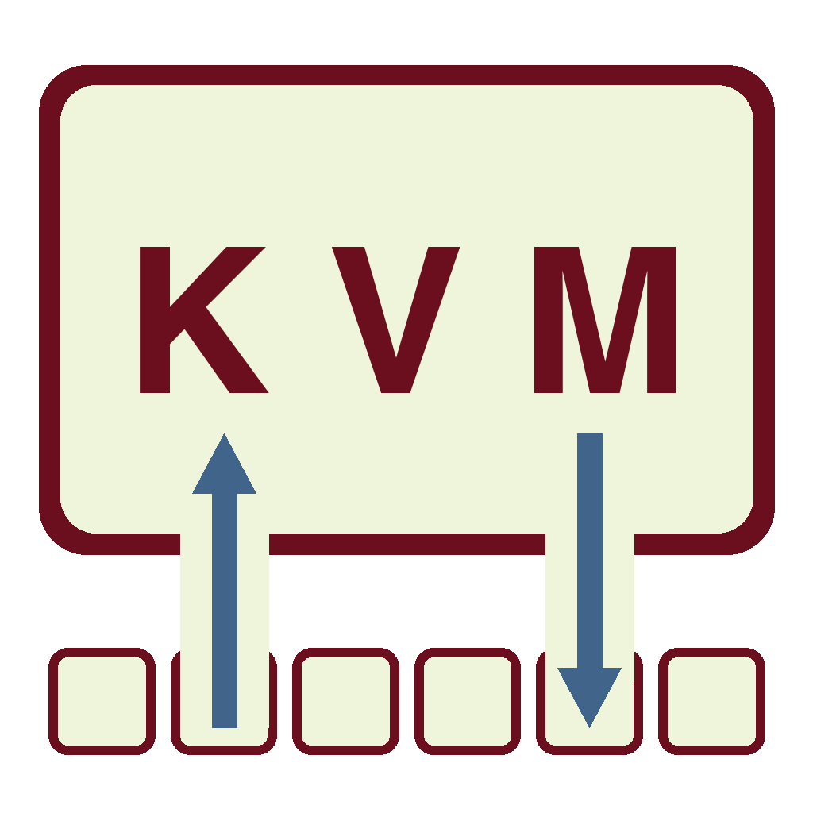

# Serial KVM Controller (CH9329 and CH9350L)

[](https://pypi.org/project/kvm-serial/)
[](LICENSE.md)
[](https://github.com/sjmf/kvm-serial/actions/workflows/lint.yml)
[](https://github.com/sjmf/kvm-serial/actions/workflows/test.yml)
[](https://codecov.io/gh/sjmf/kvm-serial)

A Software KVM for UART-to-USB-HID bridge chips (CH9329 and CH9350L).

Control your computers using an emulated keyboard and mouse!

This app and python module allows you to control a second device using a UART-to-USB-HID bridge chip
(CH9329 or CH9350L) and a video capture device. You can find these from vendors on eBay and AliExpress
for a low price. However, there is very little software support available for these modules, and protocol
documentation is sparse.

This software captures keyboard and mouse inputs from the local computer, sending these over a 
serial UART connection to the bridge chip, which will output USB HID mouse and keyboard 
movements and scan codes to the remote computer.

The `kvm_serial` package provides options for running the GUI, or as a script providing flexible options.

<a href="https://github.com/sjmf/kvm-serial/releases/latest/"> </a>

<hr />

__[Download the latest release](https://github.com/sjmf/kvm-serial/releases/latest/)__ for Windows, Mac or Linux.

*See [INSTALLATION.md](docs/INSTALLATION.md) for information on installing serial drivers, if required.*


## GUI Usage

Run the GUI using the [executable for your platform](https://github.com/sjmf/kvm-serial/releases/latest/), or with Python using `python -m kvm_serial`.


*The Serial KVM window running on OSX, controlling a Windows remote machine*

The module can be [installed from PyPI](https://pypi.org/project/kvm-serial/) (`pip install kvm-serial`),
or locally from a cloned git repo (`pip install -e .`).

The GUI app will do a lot of the work for you: it will enumerate video devices and serial ports, 
and give you a window to interact with the guest in. Application settings can be changed from the 
menus (File, Options, View), for example if the app doesn't select the correct devices by default.

kvm-serial supports both CH9329 and CH9350L bridge hardware. See the user guides for hardware-specific setup:
- [CH9329 User Guide](docs/CH9329_GUIDE.md) — cables, wiring, and usage for CH9329 modules
- [CH9350L User Guide](docs/CH9350L_GUIDE.md) — dipswitch configuration, working states, and usage for CH9350L modules
- [SUPPORTED_DEVICES.md](docs/SUPPORTED_DEVICES.md) — protocol and feature comparison

## Kit List

This module requires a little bit of hardware to get going. You will need:

* A UART-to-USB-HID bridge chip (CH9329 or CH9350L) — optionally with an assembled cable or module
* Video capture card (e.g. HDMI)

You can likely get everything you need for under £30, which is incredible when compared to the 
price of a KVM crash cart adapter.

### Bridge Module/Cable

_PLEASE NOTE: I am a hobbyist. I have no affiliation with any manufacturer developing or selling bridge hardware._  

[](https://wp.finnigan.dev/?p=682)
*A home-made serial KVM module: CH9329 module soldered to SILabs CP2102. CH340 works, too.*

Pre-assembled cables and modules are available from eBay and AliExpress:

- **CH9329 cables:** Search for "*CH9329 cable usb*". Just make sure it has "CH9329" in the name;
  a USB-A to USB-A cable won't do and can damage your machine. See the [CH9329 User Guide](docs/CH9329_GUIDE.md)
  for full hardware and wiring details.
- **CH9350L modules:** Less common than CH9329 but available; typically come as breakout boards
  with serial connector and dipswitches. See the [CH9350L User Guide](docs/CH9350L_GUIDE.md) for
  dipswitch configuration and working state selection.

You can build your own by soldering a bridge chip to a UART transceiver chip (e.g. SILabs CP2102 or CH340).

### Video Capture Card

You also need a capture card that takes the display output from your remote machine and presents it 
as a USB device to your local system. The "*UGREEN Video Capture Card HDMI to USB C Capture 
Device*" was a good balance of price versus value. The more you spend on a capture device, the more
responsive your video feed will likely be (to a point). HDMI and VGA hardware is available.

## Installing Python Dependencies

_Note:_ These instructions are not required if using the executables, but you may need to do some other setup. See [INSTALLATION.md](docs/INSTALLATION.md) for information on installing serial drivers.

**Standard installation** (running the application from `pip`):

```bash
# OPTIONAL: Create and activate a Virtual environment
python -m venv ./.venv
./.venv/scripts/activate

# Install the module from PyPI and run the GUI
pip install kvm-serial
python -m kvm-serial
```

OR using [`uv` package manager](https://docs.astral.sh/uv) (a faster alternative to pip, if available):  
*Note: `uv run` may not work on Windows. See [#15](https://github.com/sjmf/kvm-serial/issues/15).*

```bash
uv run kvm-gui
```

**Install from source** (for development- includes PyInstaller for building executables, pytest for testing, etc.):

```bash
pip install -e ".[dev]"
```

## Script Usage

A script called `control.py` is also provided for use directly from the terminal, so you can also control remotes from a headless environment! (e.g. Pi to Pi!)

Packages must be installed first. Use your preferred python package manager, e.g. `pip`, `uv`

Usage examples for the `control.py` script:

```bash
# Run using module
python -m kvm_serial.control

# Run using `uv`
uv run kvm-control

# Run with mouse and video support; use a Mac OSX serial port:
python -m kvm_serial.control -e /dev/cu.usbserial-A6023LNH

# Run the script using keyboard 'tty' mode (no mouse, no video)
python control.py --mode tty /dev/tty.usbserial0

# Run using `pyusb` keyboard mode (which requires root):
sudo python control.py --mode usb /dev/tty.usbserial0

# Increase logging using --verbose (or -v), and use COM1 serial port (Windows)
python control.py --verbose COM1

# Use CH9350L in state 3 (absolute mouse — recommended for desktop use)
python control.py --ch9350 --ch9350-state 3 /dev/cu.usbserial-XXXX

# Use CH9350L in state 2 (BIOS keyboard + relative mouse — for BIOS/UEFI use)
python control.py --ch9350 --ch9350-state 2 /dev/cu.usbserial-XXXX

# Use CH9350L in state 0 (full descriptor handshake)
python control.py --ch9350 --ch9350-state 0 /dev/cu.usbserial-XXXX
```

Use `python control.py --help` to view all available options. By default, the CH9329 protocol is used; pass `--ch9350` to switch to CH9350L protocol. See the [CH9329 User Guide](docs/CH9329_GUIDE.md) and [CH9350L User Guide](docs/CH9350L_GUIDE.md) for hardware-specific setup and usage.

Mouse capture is provided using the parameter `--mouse` (`-e`). Appropriate system permissions (Privacy and Security) may be required on macOS.

For live video, use the GUI (`kvm-gui`). See [MODES.md](docs/MODES.md) for keyboard capture mode options.

## Troubleshooting

**Permissions errors on Linux**: 
if your system user does not have serial write permissions (resulting in a permission error), you can add your user to the `dialout` group: e.g. `sudo usermod -a -G dialout $USER`. You must fully log out of the system to apply the change.

**Difficulty installing requirements**: If you get `command not found: pip` or similar when installing requirements, try: `python -m pip [...]` to run pip instead.

## Acknowledgements
With thanks to [@beijixiaohu](https://github.com/beijixiaohu), the author of the [ch9329Comm PyPi package](https://pypi.org/project/ch9329Comm/) and [GitHub repo](https://github.com/beijixiaohu/CH9329_COMM/) (in Chinese), some code of which is re-used under the MIT License.

Thank you, once again, to everyone who has [contributed](CONTRIBUTING.md) to this project.

## License
(c) 2023-26 Samantha Finnigan and contributors (except where acknowledged) and released under [MIT License](LICENSE.md).
