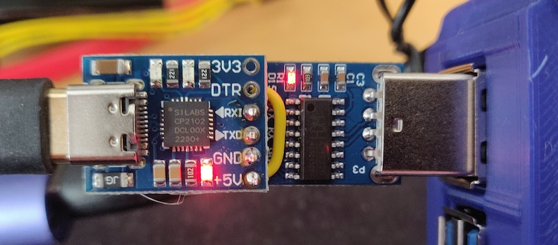

# CH9329 User Guide

The CH9329 is a UART-to-USB-HID bridge chip. It presents itself on the target PC as a composite
USB keyboard and mouse device, and receives framed commands over a TTL UART from the host
controller (kvm-serial). It is the simpler of the two supported bridge chips: no pairing handshake
or dipswitch configuration is needed, and no special flags are required in kvm-serial. CH9329 is
the default protocol.

> **Protocol reference:** [CH9329 Protocol Specification](CH9329_PROTO.md)  
> **Supported devices overview:** [Supported Devices](SUPPORTED_DEVICES.md)

---

## Hardware

### What you need

- A CH9329 module or cable (UART-to-USB-HID)
- A USB-to-UART adapter to connect the CH9329 to your host computer, **unless** using a
  pre-assembled all-in-one cable
- A USB video capture card (optional, for video feed from the remote machine)

### Pre-assembled cables and modules

Pre-assembled CH9329 cables are sold on eBay and AliExpress. Search for **"CH9329 cable usb"**.

There are two common form factors:

| Form factor | Description |
|-------------|-------------|
| **Cable** | USB-A at both ends. One end connects to the host (serial), the other to the target (USB HID). Plug-and-play — no soldering required. Make sure it has the CH9329 chip label; a plain USB-A to USB-A cable has no serial conversion and **will not work**. |
| **Module** | A small breakout board with serial header pins. Requires a separate USB-to-UART adapter (CP2102, CH340, FTDI, etc.) wired to the host computer. |

> _Note: the author has no affiliation with any manufacturer or seller._

### DIY wiring

[](https://wp.finnigan.dev/?p=682)  
*A home-made serial KVM module: CH9329 chip soldered to a SILabs CP2102 USB-to-UART adapter. CH340 works too.  
Note: this photo shows the 5 V pins connected — see the warning below before replicating this wiring.*

You can build your own module by wiring a CH9329 chip to a USB-to-UART adapter:

```text
Host PC (USB) ──► USB-to-UART adapter (e.g. CP2102 / CH340)
                        │
                        │ TX ──► RX  ┐
                        │ RX ◄── TX  ├─ CH9329 module
                        │ GND ─── GND ┘
                              │
                              ▼
                    USB-A (target PC)
```

The CH9329 operates at 3.3 V or 5 V TTL. Default baud rate is **9600 bps**; the chip also supports
1200, 2400, 4800, 14400, 19200, 38400, 57600, and 115200 bps (note: 115200 is not supported at
3.3 V). For most uses, keep the default 9600 bps.

> **⚠ Warning — do not connect the 5 V power pins together.**  
> The CH9329 module is already powered by the target machine's USB port. If you also connect
> the 5 V output of the USB-to-UART adapter to the CH9329's VCC pin (as per the image above),
> you create two power sources driving the same rail. This can backfeed voltage into one or
> both USB ports, which may damage hardware that lacks modern reverse-power protection. Wire
> only **TX, RX, and GND** between the adapter and the CH9329; leave the 5 V / VCC pins unconnected.

---

## Physical Setup

1. Connect the CH9329 module/cable to the **target machine** via USB.
2. Connect the serial end (or USB-to-UART adapter) to your **host machine** via USB.
3. Verify the device appears as a serial port on the host:
   - **macOS/Linux:** `/dev/cu.usbserial-XXXX` or `/dev/ttyUSB0`
   - **Windows:** `COM3`, `COM4`, etc. (check Device Manager → Ports)
4. On the target machine, the CH9329 should enumerate as a USB keyboard + mouse. No drivers
   are needed on the target side.

> **Driver installation:** If the serial port does not appear on your host, you may need to install
> a USB-to-UART driver. See [INSTALLATION.md](INSTALLATION.md) for platform-specific instructions.

---

## GUI Usage

No special configuration is needed for CH9329 — it is the default protocol.

1. Launch the GUI (`python -m kvm_serial` or the packaged executable).
2. Open **File → Connect** (or the connection toolbar).
3. Select your serial port from the drop-down list and click **Connect**.
4. If using a video capture card, select the camera under **Options → Camera**.
5. The app will begin forwarding your keyboard and mouse input to the remote machine.

The GUI detects CH9329 automatically; no additional menu options are required.

---

## Headless / CLI Usage

Use `kvm_serial.control` for terminal-based usage without a GUI (e.g. Raspberry Pi to Pi, or
headless servers):

```bash
# Basic keyboard forwarding only (default mode)
python -m kvm_serial.control /dev/cu.usbserial-A6023LNH

# With mouse capture enabled
python -m kvm_serial.control --mouse /dev/cu.usbserial-A6023LNH

# With video, use the GUI: python -m kvm_serial

# Windows COM port
python -m kvm_serial.control COM3

# Verbose logging
python -m kvm_serial.control --verbose /dev/cu.usbserial-A6023LNH

# Using uv
uv run kvm-control /dev/cu.usbserial-A6023LNH
```

CH9329 is the default protocol; no `--ch9350` flag is needed. Run with `--help` to see all options.

### Keyboard capture modes

By default, `curses` mode is used for keyboard-only, and `pynput` when mouse or video is enabled.
Other modes can be selected with `--mode`:

```bash
python -m kvm_serial.control --mode tty /dev/cu.usbserial-A6023LNH
python -m kvm_serial.control --mode usb /dev/cu.usbserial-A6023LNH   # requires root
```

See [MODES.md](MODES.md) for a full comparison of capture modes and their trade-offs.

---

## Troubleshooting

### Serial port not detected

- Check that the USB-to-UART driver is installed. See [INSTALLATION.md](INSTALLATION.md).
- On Linux, your user may need serial port access: `sudo usermod -a -G dialout $USER` (then log out and back in).
- On macOS, run `ls /dev/cu.*` to list available serial ports after connecting the device.

### No keyboard/mouse response on the target

- Ensure the USB end of the CH9329 is connected to the **target** machine and a USB HID device
  has enumerated (check the target's device manager or `lsusb`).
- Double-check you have not connected the USB-A ends the wrong way around (target ↔ host reversed).
- Try a different USB port or cable.
- Check baud rate: kvm-serial defaults to 9600 bps which matches the CH9329 factory default.
  If the chip has been reconfigured to a different baud rate, pass `--baud <rate>`.

### Keyboard input not captured on the host

- On macOS, pynput requires **Input Monitoring** permission (System Settings → Privacy & Security).
- Try `--mode curses` or `--mode tty` as alternatives that do not require this permission.

### Mouse coordinates appear wrong

- CH9329 uses a 12-bit absolute coordinate space (0–4095 × 0–4095).
- kvm-serial maps screen/scene coordinates to this range automatically in the GUI.
- In headless mode, absolute mouse is sent when `--mouse` is active.

---

## Further Reading

- [CH9329 Protocol Specification](CH9329_PROTO.md) — full frame format, command reference, and worked examples
- [MODES.md](MODES.md) — keyboard capture mode comparison
- [INSTALLATION.md](INSTALLATION.md) — platform-specific driver and permission setup
- [SUPPORTED_DEVICES.md](SUPPORTED_DEVICES.md) — comparison of CH9329 and CH9350L
