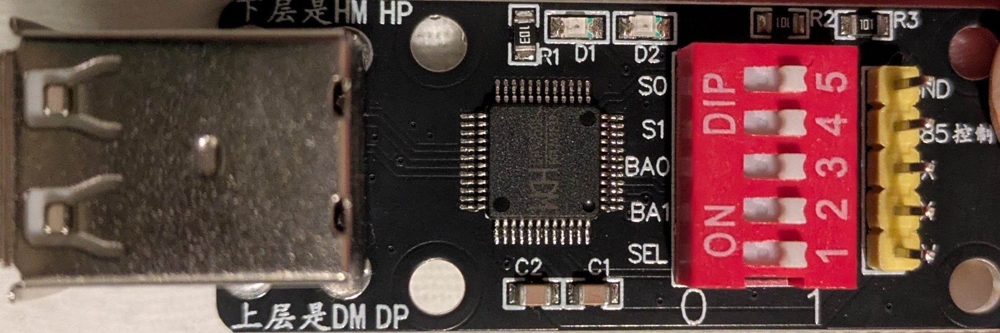
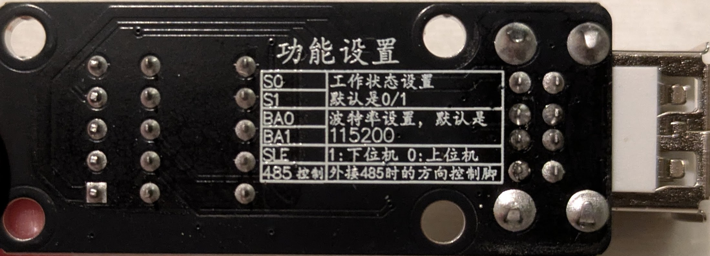

# CH9350L User Guide

The CH9350L is a paired-chip USB extender. Unlike the single-chip CH9329, it is designed to
operate as a matched pair: a **Lower Computer (LC)** module (USB host side) and an **Upper
Computer (UC)** module (USB device side). kvm-serial replaces the LC in software, speaking the
CH9350L UART protocol directly to a physical UC module, which presents USB HID keyboard and
mouse to your target machine.

> **Protocol reference:** [CH9350L Protocol Specification](CH9350L_PROTO.md)  
> **Supported devices overview:** [Supported Devices](SUPPORTED_DEVICES.md)

---

## Hardware

### What you need

- A CH9350L UC (Upper Computer) module — the end that connects to the target machine
- A short USB-A to USB-A male to male cable to connect the CH9350L module to the target
- A USB-to-UART adapter connecting the UC's serial header to your host computer
  (e.g. CP2102, CH340, FTDI, or similar at 3.3 V TTL)
- A USB video capture card (optional, for video feed from the remote machine)

> **Note:** You only need the UC board. kvm-serial software replaces the LC. While you don't need
> two CH9350L modules many sellers only sell them in pairs, and redundancy is sometimes useful.

### Sourcing hardware

CH9350L modules are less common than CH9329 cables but are available from eBay and AliExpress.
They typically come as small breakout boards with:

- A USB-A connector for the target machine (this is the UC's USB device port)
- A serial/UART header for communication
- Three dipswitches: **SEL**, **S0**, **S1** (and sometimes **BAUD0**/**BAUD1**)

Look for listings describing a "CH9350 KVM extender" or "CH9350L module" breakout board.

Here is an example of a typical CH9350L breakout module (TTL UART variant):

  
*Front: USB-A target connector (left), CH9350L chip (centre), DIP switches S0/S1/BA0/BA1/SEL (right), and serial header*

---

## Dipswitch Configuration

This is the most important setup step. The dipswitches on the UC board control its role and
working state.

  
*Back silkscreen: 功能设置 (Function Settings) — labels for S0, S1, BA0, BA1, SEL, and 485控制 (RS-485 direction control)*

The silkscreen labels translate as:

| Label | Translation |
|-------|-------------|
| S0 | Working state setting |
| S1 | Default is 0/1 |
| BA0 | Baud rate setting, default is |
| BA1 | 115200 |
| SEL | 1: Lower computer (LC) — 0: Upper computer (UC) |
| 485控制 | Direction control pin for external RS-485 connection |

Out of the box, all switches are set to 1 (HIGH). The silkscreen on the front reads `0` and `1` at the ends of the DIP switch block, indicating switch orientation (1 = ON/HIGH, 0 = OFF/LOW).

### SEL — Role selection

| SEL | Role |
|-----|------|
| 1 (ON) | Lower Computer (LC) — USB host side |
| 0 (OFF) | Upper Computer (UC) — USB device side |

Set **SEL = 0** (OFF) to configure the module as a UC. kvm-serial is the LC.

### S0 / S1 — Working state

The working state determines what USB HID descriptors the UC presents to the target machine
and which UART frame format is used.

| S0 | S1 | State | Description |
|----|----|-------|-------------|
| HIGH | HIGH | 0/1 (default) | Full descriptor handshake — kvm-serial sends HID descriptors over UART |
| LOW | HIGH | 2 | BIOS keyboard + **relative** mouse (legacy/BIOS compatible) |
| HIGH | LOW | 3 | BIOS keyboard + **absolute** mouse (recommended for most desktop use) |
| LOW | LOW | 4 | BIOS keyboard + **HID Digitizers** (multi-monitor absolute positioning) |

**Which state should I use?**

- **State 3** is the recommended starting point for most users controlling a modern desktop OS
  with an absolute mouse pointer (the cursor goes exactly where you click in the video feed).
  Because reports carry positions rather than deltas, target-side pointer acceleration has no
  effect — the cursor lands exactly where the source pointer is in the video feed.
- **State 2** is the right choice for BIOS/UEFI setup screens, boot menus, PXE boot, and
  recovery consoles. Legacy BIOS and UEFI CSM only enumerate USB HID boot-protocol devices
  with a relative mouse; the absolute-mouse descriptor used in states 3/4 will not enumerate
  in those environments. The cursor is driven by relative deltas, so target-side pointer
  acceleration applies (see the troubleshooting note below).
- **State 4** is for multi-monitor setups using HID Digitizer absolute positioning.
- **State 0/1** is the most advanced option: the UC mirrors descriptors from real USB HID
  devices. It supports relative mouse only (absolute mouse frames are silently dropped by the
  UC firmware in this state) and inherits target-side pointer acceleration as a result. Most
  users should prefer state 3 or 4.

> **BIOS/UEFI tip:** If you need to access the BIOS on the target machine, temporarily
> switch to state 2 (change S0/S1 and power-cycle the board). You can switch back to state 3
> after booting into the OS.
>
> **Important:** Set S0/S1 on the **UC board only**. When using kvm-serial as the software LC,
> only the UC board's dipswitches matter. If you purchased a pair of modules, keep the unused
> LC board aside as a spare.

### BAUD0 / BAUD1 — Baud rate

| BAUD1 | BAUD0 | Baud rate |
|-------|-------|-----------|
| 0 | 0 | 115200 (default) |
| 0 | 1 | 57600 |
| 1 | 0 | 38400 |
| 1 | 1 | 9600 |

CH9350L defaults to **115200 bps**. You will need to select the correct baud rate for the hardware
in the `baud` menu in kvm-serial.

---

## Physical Setup

1. Set the dipswitch **SEL = 0** (UC mode) and choose a working state (S0/S1).
2. Connect the UC module's USB-A connector to the **target machine**.
3. Connect the UC module's serial/UART header to your **host machine** via a 3.3 V USB-to-UART
   adapter (e.g. CP2102, CH340):

   ```text
   Host PC (USB) ──► USB-to-UART adapter (3.3 V TTL)
                     │
                     │ TX ──► RX  ┐
                     │ RX ◄── TX  ├─ CH9350L UC module
                     │ GND ── GND ┘
                     │
                     ▼
              USB-A (target PC)
   ```

4. Verify the serial port appears on the host:
   - **macOS/Linux:** `/dev/cu.usbserial-XXXX` or `/dev/ttyUSB0`
   - **Windows:** `COM3`, `COM4`, etc. (check Device Manager → Ports)

5. On the target machine, the UC should enumerate as a USB keyboard + mouse device.

> **Driver installation:** If the serial port is not detected, see [INSTALLATION.md](INSTALLATION.md)
> for platform-specific USB-to-UART driver instructions.

### USB port note

The CH9350L module has two USB-A port positions on the target side. The front silkscreen marks
them:

- **Upper row: DM / DP** — this is typically the wired USB port
- **Lower row: HM / HP** — this may not have signal lines connected on some boards

If the target machine does not enumerate a USB HID device, try the other port. The correct port
is the one where the target's keyboard LED indicators (Num Lock, Caps Lock) react when toggled
from the host.

---

## RS-485 vs TTL UART

The CH9350L supports both plain TTL UART and RS-485 on the same UART pins.

**TTL UART (3.3 V single-ended)** — recommended for most kvm-serial setups. Direct wiring to a
USB-to-UART adapter (CP2102, CH340, FTDI, etc.) works fine for typical desktop or lab distances.
A Raspberry Pi GPIO header can also be wired directly.

**RS-485 (differential, half-duplex)** — extends the link to tens of metres at 115200 bps,
or up to ~1200 m at lower baud rates, using a balanced twisted-pair cable.

> **⚠ Warning — do not connect RS-485 bus lines directly to the CH9350L.**  
> RS-485 uses differential voltages in the range of −7 V to +12 V. The CH9350L's UART pins
> are 3.3 V TTL and will be damaged by RS-485 bus voltages. This could even potentially damage
> the machine you are connecting to, over-volting its USB lines. You **must** use a separate
> RS-485 transceiver board (e.g. one based on the MAX485 or SN75176) to convert between the
> CH9350L's TTL UART and the RS-485 bus.

The CH9350L's **TNOW** pin (labelled "485控制" / "485 Control" on the board silkscreen) goes
HIGH during transmission. Wire this to the RE/DE direction-control pins of the transceiver
board to switch it between transmit and receive — this is required because RS-485 is
half-duplex. The `0x57 0xAB` UART frames are identical over RS-485; no protocol change is
needed in kvm-serial.

For most users, **TTL UART is sufficient and requires no additional hardware**.

---

## GUI Usage

1. Launch the GUI (`python -m kvm_serial` or the packaged executable).
2. Open **Options → Protocol** and select a CH9350L option.
   * **CH9350L (state 3, absolute mouse)** is recommended for GUI usage.
   * Ensure the dipswitches on your hardware match the selected option.
3. Open **Options → Baud** and select **115200** as the default for this chip.
4. kvm-serial will automatically perform any startup handshake and begin forwarding keyboard and mouse input.
5. Open **File → Save Configuration** to persist this configuration across restarts.

The GUI will indicate the connection state. For state 0/1, a descriptor handshake occurs on
first connect; for states 2/3/4 the UC accepts input frames immediately after the startup
sequence.

You can tell the handshake has succeeded when keyboard and mouse input starts working on the
target machine. If input does not work after a few seconds, see
[Troubleshooting](#troubleshooting) below.

---

## Headless / CLI Usage

Use `kvm_serial.control` with the `--ch9350` flag:

```bash
# CH9350L in state 3 (absolute mouse — recommended for desktop use)
python -m kvm_serial.control --ch9350 --ch9350-state 3 /dev/cu.usbserial-XXXX

# CH9350L in state 2 (relative mouse — for BIOS/UEFI use)
python -m kvm_serial.control --ch9350 --ch9350-state 2 /dev/cu.usbserial-XXXX

# CH9350L in default state (0/1 — descriptor handshake, relative mouse only)
python -m kvm_serial.control --ch9350 /dev/cu.usbserial-XXXX

# With mouse capture
python -m kvm_serial.control --ch9350 --ch9350-state 3 --mouse /dev/cu.usbserial-XXXX

# For video, use the GUI: python -m kvm_serial

# Verbose logging (useful for diagnosing handshake issues)
python -m kvm_serial.control --ch9350 --verbose /dev/cu.usbserial-XXXX

# Windows COM port
python -m kvm_serial.control --ch9350 --ch9350-state 3 COM3
```

Run with `--help` to see all available options.

---

## Troubleshooting

### No keyboard or mouse input on the target

The UART link may be healthy while the UC's USB port has not enumerated on the target host.
Common causes:

- **Wrong USB port on the UC board.** The module has two USB-A port positions (DM/DP upper,
  HM/HP lower); on some boards only one has the signal lines wired. Try the other if you're
  not having luck with the first.
- **Dipswitch mismatch.** Ensure SEL = 0 (UC) and S0/S1 match the state you specified with
  `--ch9350-state`. Power-cycle the board after changing dipswitches.
- **Wrong baud rate selected** Check the `BA0/BA1` dipswitches from the table above, and
  the baud rate setting in `kvm-serial`. These MUST match for the link to work.
- **Wrong end of the cable.** The USB-A connector must go to the **target**, not the host.
- **Target USB port issues.** Try a different USB port on the target machine.

### Cursor does not move in state 0/1

Absolute mouse is silently dropped by the CH9350L UC firmware in state 0/1. This is a
hardware/firmware limitation. Use **state 3** or **state 4** for absolute mouse positioning.

### Cursor lags behind on fast drags (states 0/1, 2)

In states 0/1 and 2 kvm-serial converts the source pointer's absolute position into relative
deltas, which means the cursor on the target is driven by the same path as any USB mouse
plugged in directly — including the target's **pointer acceleration**. A slow drag tracks
the source faithfully; a fast drag overshoots; a deliberate slow-down lets the source catch
up. This is a property of relative-mouse input on accelerated OSes, not a kvm-serial bug.

Mitigations:

- **Switch to state 3** if the target supports it. State 3 ships positions rather than deltas
  so target-side acceleration has no effect.
- **Disable target-side pointer acceleration** if state 3 isn't an option:
    - Windows: Settings → Devices → Mouse → Additional mouse options → Pointer Options →
      uncheck *Enhance pointer precision*
    - macOS: `defaults write -g com.apple.mouse.scaling -1` then log out (no GUI toggle)
    - Linux: per-DE — typically `xinput set-prop` for X11, or the desktop environment's
      mouse settings panel

### Descriptor handshake never completes (state 0/1)

- Run with `--verbose` to see handshake progress.
- The handshake requires the UC to echo back PID values in its keep-alive (`0x12`). If the
  UC's keep-alive never appears, check baud rate (115200), wiring (TX/RX not crossed?), and
  that the UART adapter is 3.3 V TTL.
- Try a target machine replug: if the handshake completes but input still does not work, unplug
  and re-plug the USB cable on the **target** side. kvm-serial will replay the attach sequence
  automatically.

### Serial port not detected on the host

See [INSTALLATION.md](INSTALLATION.md) for USB-to-UART driver installation instructions.
On Linux, add your user to the `dialout` group: `sudo usermod -a -G dialout $USER` (then log
out and back in).

---

## Further Reading

- [CH9350L Protocol Specification](CH9350L_PROTO.md) — full frame format, state machine, attach
  sequence, and worked examples
- [MODES.md](MODES.md) — keyboard capture mode comparison
- [INSTALLATION.md](INSTALLATION.md) — platform-specific driver and permission setup
- [SUPPORTED_DEVICES.md](SUPPORTED_DEVICES.md) — comparison of CH9329 and CH9350L
